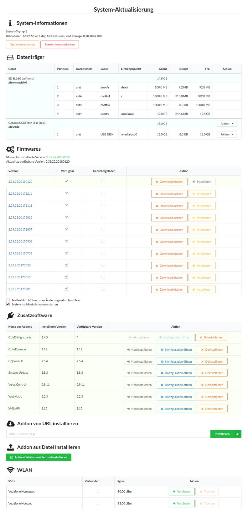

# DISCONTINUED
This repository is DISCONTINUED.
Since I have changed my own environment to Home Assistant, I currently have no possibility to further develop or maintain this addon.
I only run a CCU instance as an addon in Home Assistant.

# Addon to update RaspberryMatic system and addons
* This addon can be used to easily up- and downgrade the RaspberryMatic system.
* Most addons can be updated without having to manually download the addon file and without having to reboot the system.
* The system can be easily connected to a WiFi network.
* The userfs (/usr/local) can be moved to any usb device.

# Installation

Download the file [rmupdate.tar.gz](rmupdate.tar.gz) and install the addon in the HomeMatic WebUI of your Raspberrymatic.

